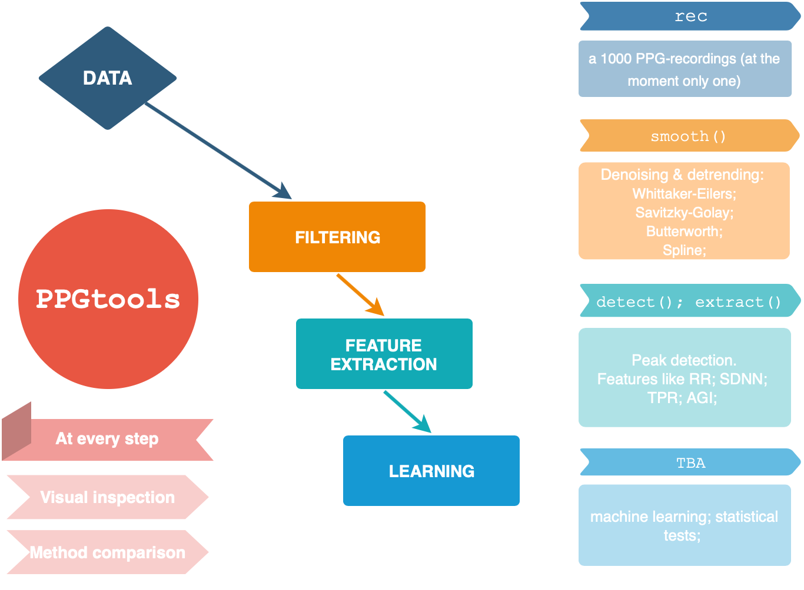

# PPGtools
` PPGtools` can be installed with the `devtools` package:

```r
# install package from private GitHub repository
devtools::install_github("GerbrichFerdinands/PPGtools", build = TRUE)
```

## Example
```r
library(PPGtools)

# prepare data
raw_signal <- prepInput(rec, channel = "Green", tstart = 20, tstop = 40)

# smooth series z
lambda <- matrix(10^(seq(1, 7, 2)), dimnames = list(paste0('lambda_', 1:4), NULL))

z <- smoothWE(raw_signal = raw_signal, lambda = lambda, d=2, uni = TRUE)

# plot results
title <- "Uniform sampling assumed, d=2, lambda = 10, 10^3, 10^5, 10^7"
plotLambda(raw_signal = raw_signal, z = z, title = title)

```

## Package structure

